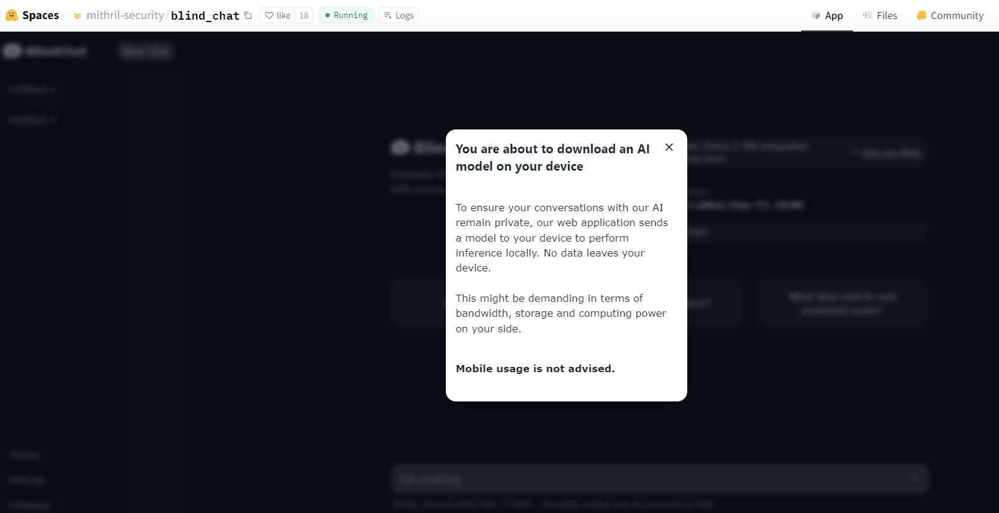

# 👋 Welcome to BlindChat!
________________________________________________________

Making Conversational AI Confidential & Transparent

## 📜 What is BlindChat?
________________________________________________________

### Introduction

🐱 **BlindChat** is an open-source project to develop **the first fully in-browser and private Conversational AI**.

Most conversational AI solutions today require users to send their data to AI providers who serve AI models as a Service. This poses privacy issues for users who **lose control over their data**.

⚠️ Because data is a key asset to improve LLMs, **many solutions more or less implicitly fine-tune users’ data to improve their model**.

This creates privacy risks for users as LLMs might learn their data by heart. Carlini et al.[1] showed that LLMs such as GPT-J could learn at least 1% of their training set by heart.

🔐 BlindChat solves this issue as users have guarantees that their data remains private at all times and have full control over it, either by doing local inference or using secure isolated environments called secure enclaves.

## 💬 BlindChat Local: Demo
________________________________________________________

### 👩‍💻 You can try out BlindChat [here](https://chat.mithrilsecurity.io)!

We enable users to interact with a [Flan-T5 model](https://huggingface.co/docs/transformers/model_doc/flan-t5) locally through their browser: the model is pulled and used for local inference using [transformers.js](https://huggingface.co/docs/transformers.js/index).

## 🌎 Who is BlindChat for?
________________________________________________________

BlindChat aims to serve two users:

- **End users:** We want to provide privacy-by-design alternatives to change the current status quo. Most users today are forced to give up their data to leverage AI services, and opaque or inexistent privacy controls are the norm.

- **Developers:** We want to help developers easily serve privacy-by-design Conversational AI, which is why we are focused on making BlindChat easy to customize and deploy.

(<a href="#readme-top">back to top</a>)

## 🎯 Roadmap
___________________________

You can check out our progress in more detail on our [official roadmap](https://github.com/orgs/mithril-security/projects/2/views/4). We highlight feature on which we would love help from contributors in our [help wanted section](https://github.com/orgs/mithril-security/projects/2/views/3).

Roadmap quick summary:

- [x] Revamping of Hugging Face Chat UI to make it entirely client-side (removal of telemetry, data sharing, server-side history of conversations, server-side inference, etc.)
- [x] Integration of privacy-by-design inference with local model
- [x] Local caching of conversations
- [ ] Integration of more advanced local models (e.g. [phi-1.5](https://huggingface.co/microsoft/phi-1_5)) and more advanced inference (e.g. [Web LLM](https://github.com/mlc-ai/web-llm))
- [ ] Integration of privacy-by-design inference with remote enclaves using BlindLlama for powerful models such as [Llama 2 70b](https://huggingface.co/meta-llama/Llama-2-70b-chat-hf) & [Falcon 180b](https://huggingface.co/tiiuae/falcon-180B)
- [ ] Integration with [LlamaIndex TS](https://github.com/run-llama/LlamaIndexTS) for local Retrieval Augmented Generation (RAG)
- [ ] Internet search
- [ ] Connectors to pull data from different sources

## 📇 Get in touch
___________________________

We would love to hear your feedback or suggestions, here are the ways you can reach us:

- Found a bug? [Open an issue!](https://github.com/mithril-security/blind_chat/issues)
- Got a suggestion? [Join our Discord community and let us know!](https://discord.com/invite/TxEHagpWd4)
- Set up [a one-on-one meeting](https://www.mithrilsecurity.io/contact) with a member of our team

Want to hear more about our work on privacy in the field AI?

- Check out our [blog](https://blog.mithrilsecurity.io/)
- Subscribe to our newsletter [here](https://blog.mithrilsecurity.io/)

Thank you for your support!

## References
___________________________

[1] Carlini, N., Ippolito, D., Jagielski, M., Lee, K., Tramer, F., & Zhang, C. (2022). Quantifying Memorization Across Neural Language Models. ArXiv. /abs/2202.07646